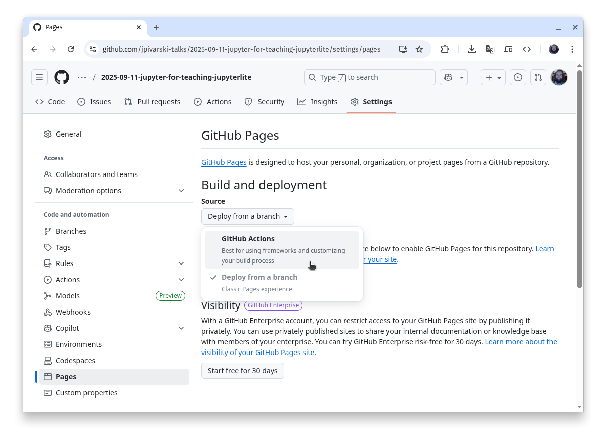
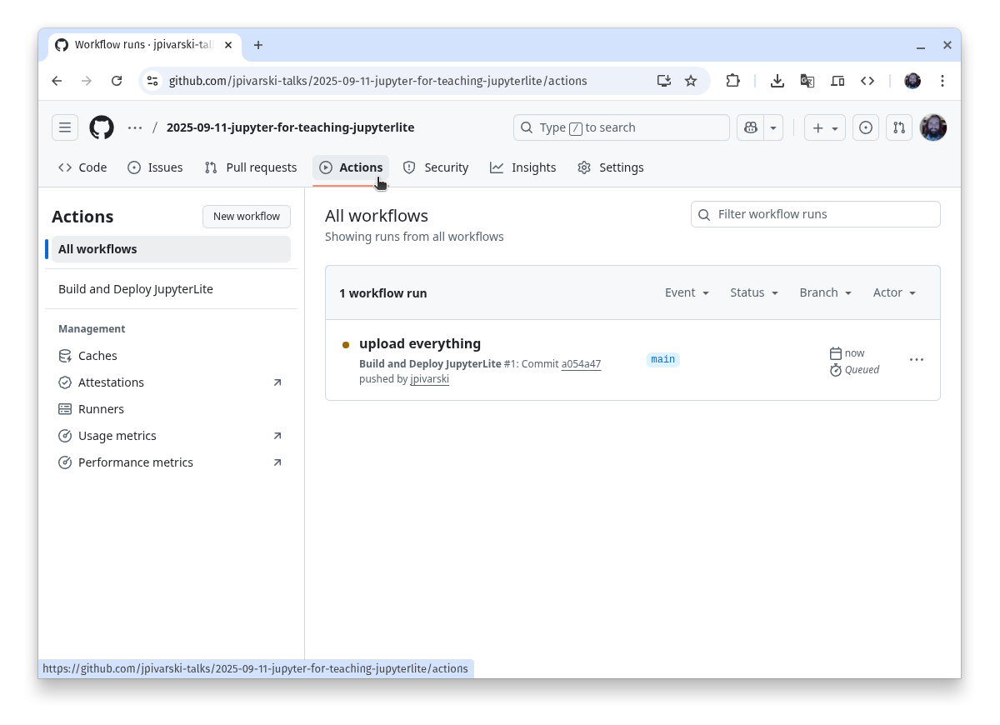
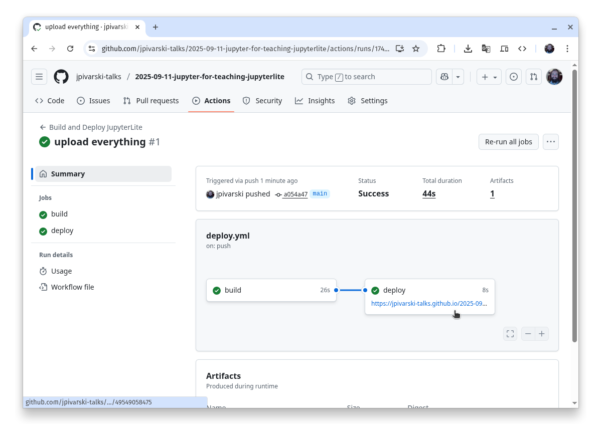
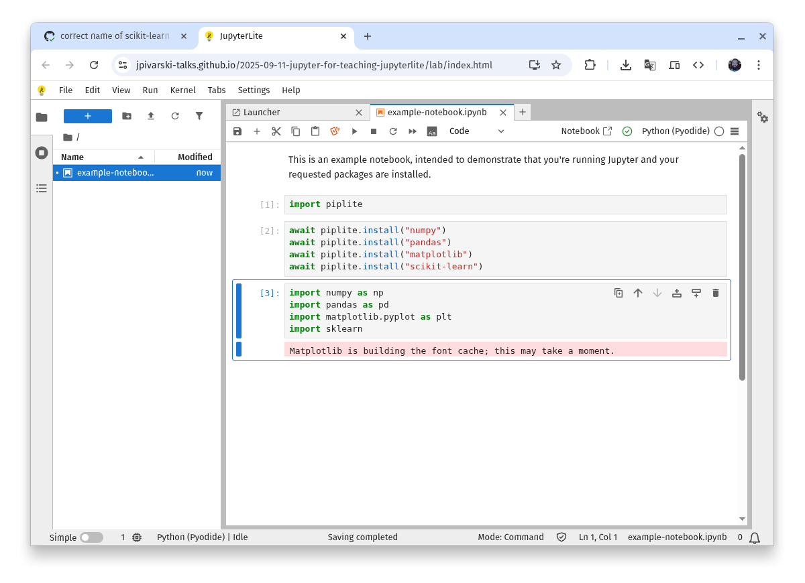

# Jupyter for Teaching (2025-09-11): JupyterLite example

In this example, we launch Jupyter in a web browser using JupyterLite.

JupyterLite runs code in your students' web browsers, _not_ on a cloud server. This is the easiest and most reliable way to get students running code because it doesn't rely on any external servers and everyone has a web browser. However,
* not all Python packages _can_ run in a web browser, only ["pure Python"](https://stackoverflow.com/q/45976946/1623645) packages on [PyPI](https://pypi.org/) and [packages that have been compiled into Pyodide](https://pyodide.org/en/stable/usage/packages-in-pyodide.html) (Python compiled for web browsers);
* those packages are not installed through `requirements.txt`, but in the notebook itself (we'll see this below).

## How to set up the repository

As a teacher, you need to set up a public repository like this one. Students just click on the URL you give them.

The configuration consists of three pieces: (1) a [site](https://github.com/jpivarski-talks/2025-09-11-jupyter-for-teaching-jupyterlite/tree/main/site) directory that configures JupyterLite, (2) all of the notebooks and data you want the students to see in a [site/files](https://github.com/jpivarski-talks/2025-09-11-jupyter-for-teaching-jupyterlite/tree/main/site/files) directory, and (3) a [.github/workflows](https://github.com/jpivarski-talks/2025-09-11-jupyter-for-teaching-jupyterlite/tree/main/.github/workflows) directory that tells GitHub how to build the website and host it (for free).

```
.
├── LICENSE
├── README.md
├── site
|   ├── jupyter-lite.json
|   ├── requirements.txt
|   └── files
|       └── example-notebook.ipynb
└── .github
    └── workflows
        └── deploy.yml
```

The [site/jupyter-lite.json](https://github.com/jpivarski-talks/2025-09-11-jupyter-for-teaching-jupyterlite/blob/main/site/jupyter-lite.json) file is the JupyterLite configuration file, which is [documented here](https://jupyterlite.readthedocs.io/en/latest/howto/configure/config_files.html). The [requirements.txt](https://github.com/jpivarski-talks/2025-09-11-jupyter-for-teaching-jupyterlite/blob/main/site/requirements.txt) only determines which Python packages are used to build the website—Jupyter, JupyterLite, and any Jupyter extensions like `jupyterlab-deck`—but not any Python packages used in the notebook, such as NumPy, Pandas, or Matplotlib.

The [.github/workflows/deploy.yml](https://github.com/jpivarski-talks/2025-09-11-jupyter-for-teaching-jupyterlite/blob/main/.github/workflows/deploy.yml) file specifies a GitHub Action that GitHub runs every time a change is made in the repository. The Action defined here installs and runs `jupyter lite` to build the website, then uses `actions/deploy-pages` to copy the website to GitHub Pages. You can copy this Action verbatim, but you may need to update versions of the Actions that it calls (`@v3`, `@v4`, `@v5`) if they get out of date.

In addition to setting up your own GitHub repository, you will need to turn on GitHub Pages in its "Settings" tab. Here's how to do that:

### Step 1

Click on the "Settings" tab, then pick "Pages" from the left sidebar. The default "Source" is "Deploy from a branch", but you'll need to change that to "GitHub Actions".



### Step 2

As soon as the `.github/workflows/deploy.yml` file exists in the repository and whenever any change is made (or you click "Run workflow" under "Actions" → "Build and Deploy JupyterLite"), the GitHub Action starts running. You can see it run by clicking on the "Actions" tab and then the latest (top) workflow run. The dots next to each workflow run tell you whether they were successful (green), failures (red), or are still running (orange/brown).





### Step 3

When the website is deployed, GitHub will tell you its URL, which will be similar to this:

https://jpivarski-talks.github.io/2025-09-11-jupyter-for-teaching-jupyterlite/

You can give this URL to students and JupyterLite will launch in seconds.



## Avoid confusion during development

You may be tempted to click on that link and try running the notebook, but here is a strong recommendation: **open the URL in Incognito Mode (or your web browser's "private" mode)**. Any changes that you make to notebooks or files will be saved in your web browser unless you use Incognito Mode. During development, you want your web browser to remember nothing, because otherwise your view of the JupyterLite website will be different from what students view, and you want to configure it to work for them, not just yourself.

## Setting up the notebooks

JupyterLite notebooks are a little different from Jupyter notebooks in other settings because JupyterLite installs software in the notebook itself. Notice that this notebook has extra cells at the top:

```python
import piplite
```

The `piplite` library works a bit like `pip install`, except that it's a Python command, rather than a terminal command. This library only exists in JupyterLite, not regular Python. The commands

```python
await piplite.install("numpy")
await piplite.install("pandas")
await piplite.install("matplotlib")
await piplite.install("scikit-learn")
```

are equivalents of `pip install numpy`, `pip install pandas` and so on. (These commands, starting with `await` outside of an `async` function, aren't even legal in regular Python!) Once the packages have been installed into the webpage, the `import` statements will work.

Not all Python packages can be installed in JupyterLite, so when you're developing a lesson that uses it, be sure to test thoroughly in JupyterLite itself. For instance, PyTorch can't be installed, but Scikit-Learn can.

In addition, JupyterLite has other limitations, such as
* threads and subprocesses do not work;
* terminal commands (starting with `!`) do not work;
* some standard library modules do not work (such as `tkinter`).
It can be hard to guess which of the libraries that you use rely on these features of standard Python, so test everything while you develop the lesson!

Despite these hardships on you as a teacher, JupyterLite is the easiest and most streamlined way for students to get up and running.
